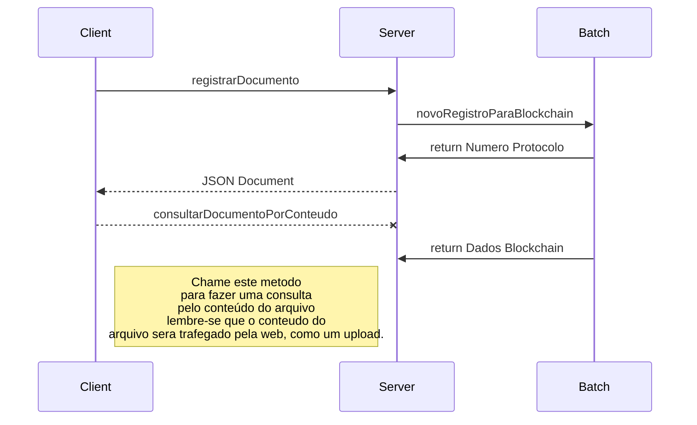

# Java Client for Blockchain API

Este é um projeto **MAVEN** de exemplo para um cliente da API escrito em Java. A classe principal que você provavelmente terá dentro do seu projeto é a classe **com.astarlabs.api.blockchain.Blockchain**.

# Como utilizar

Você deverá começar pela classe App.java, no método main temos 3 métodos, sendo que 2 estão comentados.

 **registarNovoDocumento**
 Efetua o registro gerando sempre um novo documento, portanto a API sempre irá retornar um número de protocolo novo.

  **registrarDocumentoExistente**
  Tenta registrar um documento que já foi registrado anteriormente, o que ocorre é que a API informa via JSON que o documento já está registrado. Após isso efetuamos uma consulta por conteúdo do documento (supomos que você não tem o número de protocolo)

   **consultarPorProtocolo**
   Caso você tenha o número de protocolo, efetua uma chamada da API e retorna os dados da Blockchain.

## Bibliotecas

Todas as bibliotecas podem ser obtidas no site https://mvnrepository.com/

## Problemas comuns

Aqui uma lista dos problemas que podem ocorrer ao se utilizar uma API assíncrona

## Token used before issued

Caso a API retorne este erro, verifique o relógio da sua máquina, normalmente é um problema de sincronismo entre o relógio da sua máquina e o relógio do servidor.

## API não retorna

Verifique se você está utilizando algum proxy, ou existe alguma restrição na sua rede, você está utilizando uma **VPN**.

Verifique se você consegue acessar o endereço     **https://blockchain.astar.tech/v2**.

## O cliente Java não compila

Verifique se você consegue baixar as dependências do **MAVEN**, pode existir alguma restrição de rede e você pode não conseguir acessar alguns sites de repositórios como o  **https://mvnrepository.com/**. 

## UML diagrams

You can render UML diagrams using [Mermaid](https://mermaidjs.github.io/). For example, this will produce a sequence diagram:

----------

